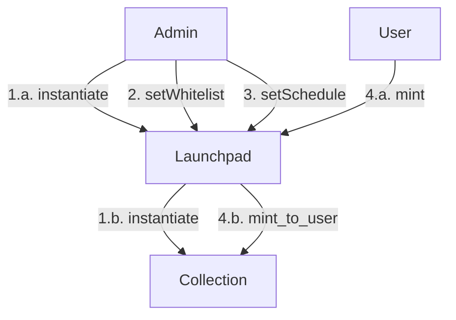

# The Launchpad
## Goals
The launchpad needs to satisfy the following conditions:
- Managed by our admins. Because projects will be launched under Aura, we need to be able to manage their content and other information.
- Supports multiple launch strategies:
    - **public mint**: anyone with a wallet can mint
    - **whitelist mint**: only whitelisted wallets can mint
    - **randomly mint:** mint a NFT randomly from a list of predefined NFTs.
    - **scheduled mint phase:** different whitelists mint, public mint (*mint phase*) happens in a scheduled timeline.

## Proposed Solution


## Launchpad Contract
This contract manages an individual launchpad. There is an admin which has total authority over how to config it. A NFT contract will be instantiated together with this contract and set this contract as the only minter.

### ExecuteMsg

There are 7 messages for administrative management purpose and can be called by admin only, they are:
- `AddMintPhase`
- `UpdateMintPhase`
- `RemoveMintPhase`
- `AddWhitelist`
- `RemoveWhitelist`
- `DeactivateLaunchpad`
- `ActivateLaunchpad`

The first 5 messages can be executed **only** when status of launchpad is `inactive`. By default, the status of launchpad after instantiation is `inactive`. To `active` the launchpad , admin will execute the `ActivateLaunchpad`. The last 2 messages `DeactiveLaunchpad` and  `ActivateLaunchpad` are used to switch status of launchpad to `inactive` and `active` at anytime by admin.

`AddMintPhase{after_phase_id, phase_data}` - This message allows admin add new *mint phase* to launchpad. 
The **optional** parameter `after_phase_id` is used to determine the position of *mint phase* in the list of phases. 
By default, new phase will be added to the end of the list. If a phase allows each user mints unlimited Nft, then the `max_nfts_per_address` value should be set equal to `max_supply`.

A `phase_data` contains the following data for a new phase:
```rust
pub struct PhaseData {
    pub start_time: Timestamp,
    pub end_time: Timestamp,
    pub max_supply: Option<u64>,
    pub max_nfts_per_address: u64,
    pub price: u128,
    pub is_public: bool,
}
```

`UpdateMintPhase{phase_id, phase_data}` - Admin can update the data in `phase_data` of a phase by specifying its `phase_id`. 
Requires `phase_id` to point to a valid phase.

`RemoveMintPhase{phase_id}` - Removes a phase pointed by a `phase_id`. Requires `phase_id` to point to a valid phase.

`AddWhitelist{phase_id, whitelists}` - Allows the address of users in `whitelists` to mint the Nfts at in phase with `phase_id`. 

`RemoveWhitelist{phase_id, addresses}` - Disallow the address of users in `addresses` to mint the Nfts at the current phase with `phase_id`.

`DeactivateLaunchpad{}` - Admin can deactivate this launchpad if it is active.

`ActivateLaunchpad{}` - Admin can activate this launchpad if it is inactive.

The only message can be called by a normal user is `Mint`.

`Mint{phase_id, amount}` - A user in whitelist can mint a Nft in the phase pointed by `phase_id`. If the phase is a public phase, every users can mint Nft.

The `amount` is an optional parameter providing the number of Nfts that user want to mint. By default, the `amount` is equal to 1 and it cannot be greater than 10.

Additional, the contract has a message to support the `creator` of collection claim the profit of selling Nfts.

`Withdraw{denom}` - The `creator` can claim his profit by providing the denom of supported Native token. All balance of specific native token (after deducting the launchpad service fee) will be sent to the `creator`. The address of `creator` and launchpad service fee must be specified when instantiation contract.

### QueryMsg

`GetLaunchpadInfo{}` - User can query the information of launchpad by this message.

The `LaunchpadInfo` response includes:
```rust
pub struct LaunchpadInfo {
    pub creator: Addr,
    pub launchpad_fee: u32,
    pub collection_address: Addr,
    pub total_supply: u64,
    pub max_supply: u64,
    pub uri_prefix: String,
    pub uri_suffix: String,
    pub first_phase_id: u64,
    pub last_phase_id: u64,
    pub last_issued_id: u64,
    pub is_active: bool, 
}
```

`GetAllPhaseConfigs{}` - Retrieves the information of all phases of launchpad.

The response of this query is a vector of `PhaseConfigResponse`:
```rust
pub struct PhaseConfigResponse {
    pub phase_id: u64,
    pub start_time: Timestamp,
    pub end_time: Timestamp,
    pub max_supply: Option<u64>,
    pub total_supply: u64,
    pub max_nfts_per_address: u64,
    pub price: Coin,
    pub is_public: bool,
}
```

`Mintable{user: String}` - Query the number of remaining nfts that `user` can mint in all phases of launchpad.

The response of this query is a vector of `MintableResponse`:
```rust
pub struct MintableResponse {
    pub phase_id: u64,
    pub remaining_nfts: u64,
}
```